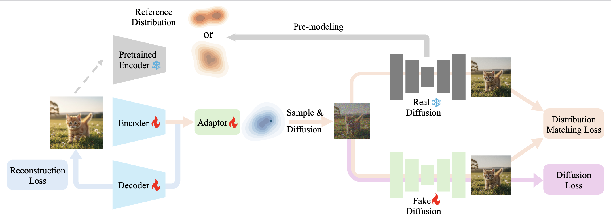

# Distribution Matching Variational AutoEncoder (DMVAE)

This repository contains the official implementation of the paper [“Distribution Matching Variational AutoEncoder”](https://arxiv.org/abs/2512.07778).

> **Distribution Matching Variational AutoEncoder**  
> Sen Ye, Jianning Pei, Mengde Xu, Shuyang Gu, Chunyu Wang, Liwei Wang, Han Hu  
> PKU, UCAS, Tencent

---



---


## Installation

### 1. Environment

```bash
conda create -n dmvae python=3.10 -y
conda activate dmvae

pip install torch==2.5.1 torchvision==0.20.1 torchaudio==2.5.1

pip install -r requirements.txt
```

### 2. pretrained VAE & Diffusion Checkpoint
🤗 [Model on Hugging Face](https://huggingface.co/sen-ye/dmvae)
* DMVAE: ``vae.pt``, ``latent_mean=0.0685, latent_scale=0.1763``
* DiT checkpoint at epoch 64: ``ep64.pt``
* DiT checkpoint at epoch 400: ``ep400.pt``
* DiT checkpoint at epoch 800: ``ep800.pt``
### 3. Data Preparation

By default, all training scripts assume **ImageNet** data under: `./data/ImageNet`

You can change this path via the `--dataset_path` argument in each script.


## Toy Example
We provide a toy example for probing the effect of different distribution matching loss in `toy_example_2d/`.

* `sshape.py` is used to generate a 2D reference distribution.
* `train_diffusion.py` is used to train $s_{\text{real}} (v_{\text{real}})$ modelling the reference distribution.
* `dmd.py` is used to align a uniform distribution to the reference distribution by different losses.

Train a LightningDiT-Mini to model the reference distribution:
```bash
torchrun --nproc_per_node=1 toy_example_2d/train_diffusion.py --base_dir "your_exp_dir"
```

Then run distribution matching:
```bash
torchrun --nproc_per_node=1 toy_example_2d/dmd.py --log_dir "your_exp_dir" --real_model_ckpt_path "s_real_path" --fake_model_ckpt_path "s_real_path" --dmd_loss_type "dmd"
```

## Training & Evaluation Pipeline

### Stage 1. DMVAE Training Pipeline
#### Step 1. Tokenizer Pretrain
```bash
bash scripts/train_tokenizer.sh
```

#### Step 2. Reference Modelling
```bash
bash scripts/train_diffusion.sh
```


#### Step 3. DMD Training

```bash
bash scripts/train_dmd.sh
```

### Stage 2. Diffusion Modelling
Set ``vae_ckpt_path`` of the tokenizer after DMD training and run `bash scripts/train_diffusion.sh` .


### 4. Evaluation & 50k Sampling

To reproduce the paper results:

1. Download **pretrained VAE** and **pretrained DiT** checkpoints.
2. Set `vae_ckpt_path`, `ckpt` accordingly.
3. Run:

```bash
bash scripts/sample50k.sh
```


## Citation

If you find this repository useful in your research or applications, please consider citing:

```text
@misc{dmvae,
      title={Distribution Matching Variational AutoEncoder}, 
      author={Sen Ye and Jianning Pei and Mengde Xu and Shuyang Gu and Chunyu Wang and Liwei Wang and Han Hu},
      year={2025},
      eprint={2512.07778},
      archivePrefix={arXiv},
      primaryClass={cs.CV},
      url={https://arxiv.org/abs/2512.07778}, 
}
```

